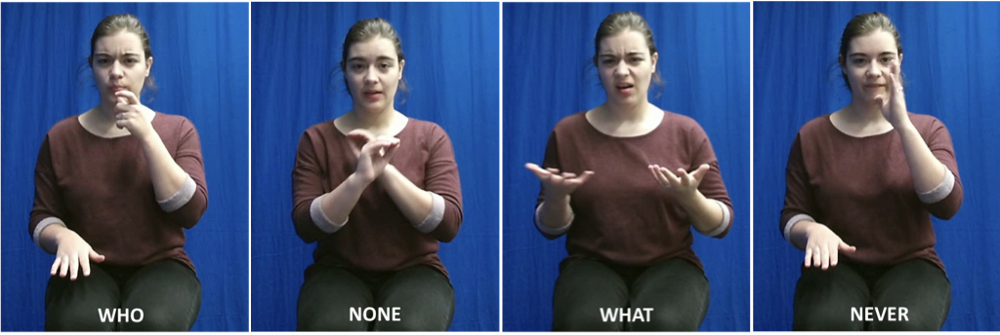
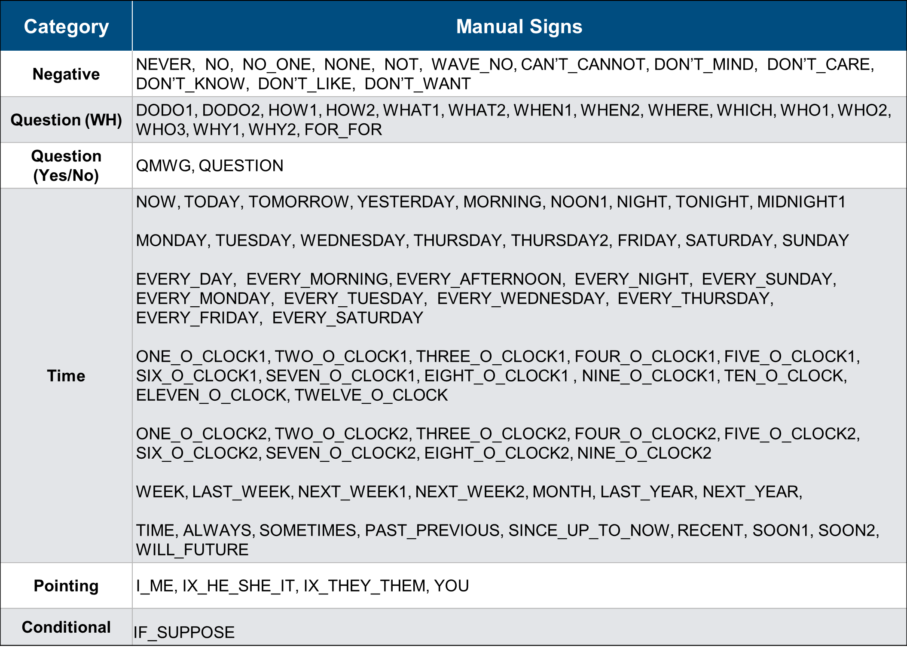

 
<b>
 Recognizing American Sign Language Manual Signs from RGB-D Videos   
</b>

Longlong Jing, Elahe Vahdani, Yingli Tian, Fellow, IEEE, and Matt Huenerfaut

------

 
<b>
 Abstract  
</b>

In this paper, we propose a 3D Convolutional Neural Network (3DCNN) based multi-stream framework to recognize American Sign Language (ASL) manual signs (consisting of movements of the hands, as well as non-manual face movements in some cases) in real-time from RGB-D videos, by fusing multimodality features including hand gestures, facial expressions, and body poses from multi-channels (RGB, depth, motion, and skeleton joints.) To learn the overall temporal dynamics in a video, we generate a proxy video by selecting a subset of frames for each video which then be used to train the proposed 3DCNN model. We collect a new ASL dataset, ASL-100-RGBD, which contains 42 RGB-D videos, each of 100 ASL manual signs, including RGB channel, depth maps, skeleton joints, face features, and HDface. The dataset is fully annotated for each semantic region (i.e. the time duration of each word that the human signer performs). Our proposed method achieves 75.9% accuracy from only RGB channel and 80.3% from the fusion of multi-channels for recognizing 100 ASL words, which demonstrate the effectiveness of recognizing ASL signs from RGB-D videos.

------

 
<b>
 ASL-100-RGBD Dataset  
</b>

A new dataset has been collected for this research in collaboration with ASL computational linguistic researchers, from native ASL signers (individuals who have been using the language since very early childhood) who performed a word list of 100 ASL signs by using a Kinect V2 camera. Participants responded affirmatively to the following screening question: Did you use ASL at home growing up, or did you attend a school as a very young child where you used ASL? Participants were provided with a slide-show presentation that asked them to perform a sequence of 100 individual ASL signs, without lowering their hands between words. Since this new dataset includes 100 signs with RGB and depth data, we refer to it as the ASL-100-RGBD dataset. 
There is a total of 42 videos recorded from 22 participants each performing 100 ASL signs. Each video includes 4 channels: RGB, Skeleton, Depth and HDfaceb recorded by Kinect V2 camera. The following video is one performance among 42 videos. We merged all channels (RGB, Depth, Skeleton and HDface) of this video into one single video for a better demonstration. The upper left corner frames are RGB frames, the upper right frames are Skeleton frames, the lower left frames are Depth images and the lower right frames are HDface frames. The  Kinect V2 has RGB image resolution of 1920 x 1080 pixels (same for Skeleton and HDface frames) and Depth image resolution of 512 x 424. All frames for all channels (RGB, Depth, Skeleton and HDface) are resized to 480 * 270. The skeleton channel has 25 body joints for each frame and HDface channel includes 1,347 points. 

<video width="950" height="540" controls>
  <source src="./media/demovideo.mp4" type="video/mp4">
</video>

------

 
<b>
 Full List of the 100 ASL words in ASL-100-RGBD Dataset 
</b>

The full list of the 100 ASL words in our ASL-100-RGBD" dataset under 6 semantic categories. These ASL words have been strategically selected to support sign recognition technology for ASL education tools (many of these words consist of both hand gestures and facial expression changes.)

